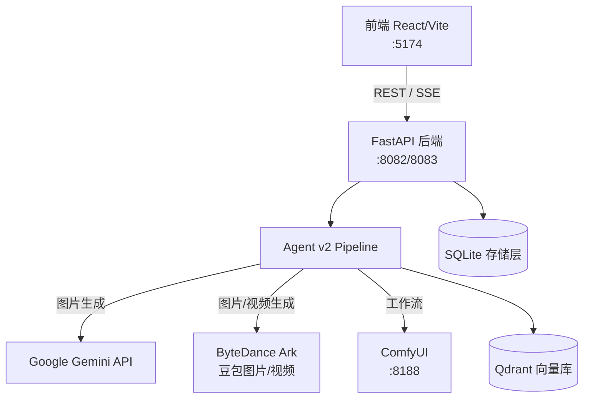

# BananaFlow Studio — 系统架构文档

## 系统架构图



## Agent v2 Pipeline 流程

```
POST /api/agent/message
    │
    ▼
handle_agent_message (gateway/service.py)
    │
    ├─ context_builder      构建对话上下文 / 摘要历史
    ├─ capability_catalog   枚举可用工具和虚拟能力
    ├─ coordinator          LLM 路由：判断请求类型（分镜/工具/RAG/通用）
    │
    └─ dispatcher           执行分支：
        ├─ canvas_planner_adapter   分镜 / 脚本规划（LangGraph）
        ├─ ToolExecutor             内置工具注册表执行
        ├─ retrieval                Qdrant 向量检索
        └─ LLM 通用回答
    │
    ▼
synthesizer    归一化响应 → AgentMessageResponse
```

## 异步任务流程

长耗时任务（AI 图片生成、视频处理）采用 start/poll 模式，避免 HTTP 超时：

```
客户端                          后端
  │                              │
  ├─ POST /api/xxx/start ───────►│ 创建任务记录（SQLite），返回 task_id
  │                              │ asyncio.create_task() 后台执行
  │                              │
  ├─ GET /api/xxx/status/{id} ──►│ 查询 SQLite 返回当前状态
  │◄─ {status: "RUNNING", ...} ──┤
  │                              │
  ├─ GET /api/xxx/status/{id} ──►│
  │◄─ {status: "SUCCESS", url}───┤
  │                              │
  ├─ DELETE /api/xxx/{id} ──────►│ 标记 CANCELLED，后台任务检测后停止
```

任务状态机：`PENDING → RUNNING → SUCCESS / FAILED / TIMEOUT / CANCELLED`

全局超时由 `AI_CHAT_TASK_GLOBAL_TIMEOUT_SEC`（默认 1800s）控制，防止任务无限重试。

## 模块边界

| 目录 | 职责 | 对外接口 |
|---|---|---|
| `api/routes.py` | 所有 HTTP 路由（~4500 行，待 Phase 1 拆分） | REST endpoints |
| `api/health_routes.py` | `/healthz` + `/readyz` | REST endpoints |
| `agent_v2/gateway/` | Agent pipeline 入口、路由、调度 | `handle_agent_message()` |
| `agent_v2/storyboard/` | 分镜设计 Agent（规划，不生成） | `StoryboardDesigner` |
| `services/comfyui.py` | ComfyUI HTTP 客户端，所有工作流 (~63KB) | `run_*_workflow()` |
| `services/genai_client.py` | Gemini / Ollama 统一客户端 | `generate_image()` / `chat()` |
| `services/ark.py` | 豆包图片生成 | `generate_ark_image()` |
| `sessions/service.py` | 会话存储（SQLite） | `get_session()` / `save_session()` |
| `memory/service.py` | 用户偏好存储（SQLite） | `get_preferences()` / `save_preferences()` |
| `retrieval/` | Qdrant 向量检索 | `search_assets()` |
| `core/config.py` | 所有配置常量（从 env 读取） | 模块级常量 |
| `core/config_guard.py` | 空配置快速失败 | `require_endpoint()` |

## 关键数据流

**图片生成请求：**
```
前端 → POST /api/ai_chat_image_via_curl
     → 创建任务（SQLite, PENDING）
     → asyncio.create_task(_run_ai_chat_image_task)
     → 后台：构建 curl 命令 → 调用下游 AI Chat API
     → 更新任务状态（SUCCESS/FAILED）
     → 前端轮询 GET /api/ai_chat_image_via_curl/{task_id}
```

**Agent 消息请求：**
```
前端 → POST /api/agent/message（SSE 流式）
     → coordinator 判断意图
     → dispatcher 执行（工具调用 / 分镜规划 / RAG）
     → synthesizer 归一化
     → SSE 流式返回给前端
```

## 存储层（SQLite 分库）

| 数据库文件 | 存储内容 | 关键变量 |
|---|---|---|
| `auth.db` | 用户账户、配额 | `AUTH_DB_PATH` |
| `data/sessions.db` | 对话会话上下文 | `BANANAFLOW_SESSIONS_DB_PATH` |
| `data/memories.db` | 用户偏好/记忆 | `BANANAFLOW_MEMORIES_DB_PATH` |
| `data/assets.db` | 素材向量索引 | `BANANAFLOW_ASSET_DB_PATH` |
| `data/asset_library.db` | 素材库元数据 | `BANANAFLOW_ASSET_LIBRARY_DB_PATH` |
| `data/ai_chat_tasks.db` | 异步任务队列 | `AI_CHAT_TASK_DB_PATH` |

## 错误处理与降级策略

- **外部依赖不可用：** ComfyUI / Ark / Gemini 调用失败 → 返回 HTTP 503，不崩溃
- **异步任务失败：** 最多重试 `AI_CHAT_TASK_MAX_RETRIES` 次；超出全局超时标记 TIMEOUT
- **配置缺失：** `require_endpoint()` 在调用点抛出 503，信息明确（而非生成错误 URL）
- **事件循环阻塞：** 同步 I/O（下载图片、执行 curl）均通过 `asyncio.to_thread` 或 `asyncio.create_task` 移出事件循环

## 安全边界与工具治理

- JWT 鉴权：HMAC-SHA256，密钥由 `JWT_SECRET` 控制，开发默认值 `/readyz` 标 degraded
- 工具调用由 `coordinator` 路由，`dispatcher` 执行，无直接代码执行能力
- ComfyUI 工作流模板固定（JSON 文件），参数注入前有合法性检查
- 用户上传文件落盘于 `tmp/`，定期清理

## 当前架构 vs 目标架构

| 维度 | 当前（Phase 0） | 目标（Phase 1-5） |
|---|---|---|
| 路由 | 单文件 routes.py（~4500 行） | 按功能拆分（agent/media/storyboard/session） |
| 任务队列 | asyncio + SQLite 轮询 | Redis + arq 分布式队列 |
| 存储 | SQLite | PostgreSQL（生产）|
| 文件存储 | 本地磁盘 | 对象存储（OSS/S3）|
| 安全 | HMAC-SHA256 JWT | bcrypt 密码 + 工具风险等级 + HITL |
| 观测 | 无 | Prometheus + Langfuse 追踪 |
| 前端 | 单文件 Workbench.jsx（~19k 行） | 功能模块拆分 |

## Phase 1 改造计划简述

将 `bananaflow/api/routes.py` 拆分为：
- `api/agent_routes.py` — Agent 消息、画布规划
- `api/media_routes.py` — 图片/视频生成任务
- `api/storyboard_routes.py` — 分镜相关
- `api/session_routes.py` — 会话管理
- `api/memory_routes.py` — 用户记忆

每个模块增加服务层（`services/` 或 `xxx/service.py`），路由层只做参数解析和 HTTP 响应。
