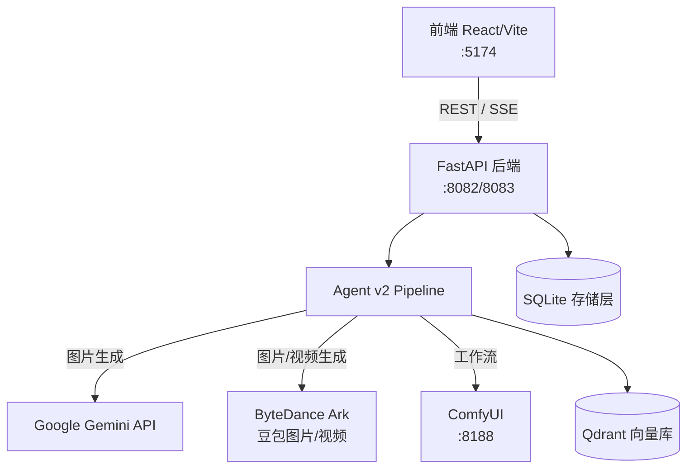

# Phase 0 工程化包装实施计划

> **For agentic workers:** REQUIRED SUB-SKILL: Use superpowers:subagent-driven-development (recommended) or superpowers:executing-plans to implement this plan task-by-task. Steps use checkbox (`- [ ]`) syntax for tracking.

**Goal:** 将 BananaFlow Studio 从 MVP 状态整理为可对外展示的专业工程项目：补全文档、去除内网依赖、清理已提交状态文件、添加健康检查端点。

**Architecture:** 本阶段不新增业务逻辑，只做工程卫生整理。新建 `config_guard.py` 提供 `require_endpoint()` 供路由层调用；新建 `health_routes.py` 挂载到 `app_factory.py`；文档和配置文件均为独立新文件，不依赖其他任务。

**Tech Stack:** Python 3.11 / FastAPI / httpx（后端）；React / Vite / JavaScript（前端）；pytest（测试）

---

## 文件变更总览

| 操作 | 文件 | 说明 |
|---|---|---|
| 新建 | `bananaflow/core/config_guard.py` | `MissingConfigError` + `require_endpoint()` |
| 新建 | `bananaflow/api/health_routes.py` | `/healthz` + `/readyz` |
| 新建 | `tests/test_config_guard.py` | config_guard 单元测试 |
| 新建 | `tests/test_health_routes.py` | 健康端点测试 |
| 新建 | `.env.example` | 全量变量说明 |
| 重写 | `README.md` | 替换 Vite 模板 |
| 新建 | `docs/architecture.md` | 系统架构文档 |
| 新建 | `docs/interview-demo.md` | 面试演示文档 |
| 修改 | `.gitignore` | 补 `*.db` 等模式 |
| 修改 | `bananaflow/app_factory.py` | 注册 `health_router`；移除硬编码内网 CORS IP |
| 修改 | `bananaflow/core/config.py` | `COMFYUI_URL` 默认值→localhost；`AI_CHAT_DOWNSTREAM_URL` 默认值→`""` |
| 修改 | `bananaflow/api/routes.py` | `MEMBER_API_BASE` 默认值→`""`；用 HTTPException 替换空 URL fallback |
| 修改 | `src/config.js` | `envText()` 标准化；移除内网 IP 默认值 |
| 修改 | `src/api/memberInfo.js` | `buildUrl` 空 API_ROOT 时抛出明确错误 |
| 修改 | `src/api/userAuths.js` | 同上 |
| 修改 | `src/api/aiChat.js` | 同上 |
| git rm --cached | `*.db`（10 个文件） | 取消追踪，保留本地文件 |

---

## Task 1: 清理 .gitignore 并取消追踪 .db 文件

**Files:**
- Modify: `.gitignore`

- [ ] **Step 1: 确认当前已追踪的 .db 文件清单**

```bash
git ls-files '*.db'
```

期望输出（共 10 个）：
```
bananaflow/auth_test.db
bananaflow/data/asset_library.db
bananaflow/data/assets.db
bananaflow/data/memories.db
bananaflow/data/sessions.db
data/asset_library.db
data/assets.db
data/memories.db
data/sessions.db
data/storyboard_tasks.db
```

- [ ] **Step 2: 更新 `.gitignore`**

在 `.gitignore` 文件现有内容的 `# Logs` 段之前插入：

```gitignore
# Runtime state files — never commit
*.db
*.db-journal
*.sqlite
*.sqlite3
*.sqlite-wal
*.sqlite-shm
Thumbs.db
.run/
tmp/
debug_output/
```

- [ ] **Step 3: 取消追踪所有 .db 文件**

```bash
git ls-files '*.db' | xargs git rm --cached
```

期望输出（10 行 `rm 'xxx.db'`）：
```
rm 'bananaflow/auth_test.db'
rm 'bananaflow/data/asset_library.db'
...
```

- [ ] **Step 4: 确认本地文件未被删除**

```bash
ls bananaflow/auth_test.db data/sessions.db
```

期望：两个文件仍存在，无报错。

- [ ] **Step 5: 提交**

```bash
git add .gitignore
git commit -m "chore: untrack committed .db state files and extend .gitignore"
```

---

## Task 2: 新建 config_guard.py

**Files:**
- Create: `bananaflow/core/config_guard.py`
- Create: `tests/test_config_guard.py`

- [ ] **Step 1: 写失败测试**

新建 `tests/test_config_guard.py`：

```python
"""Tests for bananaflow.core.config_guard."""
from __future__ import annotations

import os
import sys

ROOT_DIR = os.path.dirname(os.path.dirname(__file__))
if ROOT_DIR not in sys.path:
    sys.path.insert(0, ROOT_DIR)
BANANAFLOW_DIR = os.path.join(ROOT_DIR, "bananaflow")
if BANANAFLOW_DIR not in sys.path:
    sys.path.insert(0, BANANAFLOW_DIR)

import unittest
from bananaflow.core.config_guard import MissingConfigError, require_endpoint


class TestRequireEndpoint(unittest.TestCase):
    def test_returns_stripped_url(self):
        result = require_endpoint("FOO", "http://localhost:8080/")
        self.assertEqual(result, "http://localhost:8080")

    def test_raises_on_empty_string(self):
        with self.assertRaises(MissingConfigError) as ctx:
            require_endpoint("FOO_URL", "")
        self.assertIn("FOO_URL", str(ctx.exception))

    def test_raises_on_whitespace(self):
        with self.assertRaises(MissingConfigError):
            require_endpoint("FOO_URL", "   ")

    def test_raises_on_none(self):
        with self.assertRaises(MissingConfigError):
            require_endpoint("FOO_URL", None)

    def test_error_is_runtime_error_subclass(self):
        with self.assertRaises(RuntimeError):
            require_endpoint("FOO_URL", "")


if __name__ == "__main__":
    unittest.main()
```

- [ ] **Step 2: 运行，确认失败**

```bash
.venv/bin/python -m pytest tests/test_config_guard.py -v
```

期望：`ERROR` 或 `ImportError`（模块不存在）。

- [ ] **Step 3: 实现 config_guard.py**

新建 `bananaflow/core/config_guard.py`：

```python
"""Fail-fast helpers for required configuration values."""
from __future__ import annotations


class MissingConfigError(RuntimeError):
    """Raised when a required configuration value is absent."""


def require_endpoint(name: str, url: str | None) -> str:
    """Return *url* stripped of trailing slash, or raise MissingConfigError.

    Use at route-handler call sites to turn a missing env var into a clear
    503 rather than a malformed URL silently sent to the wrong host.
    """
    value = str(url or "").strip()
    if not value:
        raise MissingConfigError(
            f"配置缺失：{name} 未设置，请在 .env 中配置"
        )
    return value.rstrip("/")
```

- [ ] **Step 4: 运行，确认通过**

```bash
.venv/bin/python -m pytest tests/test_config_guard.py -v
```

期望：5 个 PASSED。

- [ ] **Step 5: 提交**

```bash
git add bananaflow/core/config_guard.py tests/test_config_guard.py
git commit -m "feat: add config_guard.py with require_endpoint() and MissingConfigError"
```

---

## Task 3: 配置去内网化（config.py、routes.py、app_factory.py）

**Files:**
- Modify: `bananaflow/core/config.py:48,174`
- Modify: `bananaflow/api/routes.py:274,784`
- Modify: `bananaflow/app_factory.py:36-47`

- [ ] **Step 1: 修改 `bananaflow/core/config.py`**

找到以下两行并替换：

```python
# 修改前（第 48 行）
COMFYUI_URL = os.getenv("COMFYUI_URL", "http://192.168.20.30:8188").rstrip("/")

# 修改后
COMFYUI_URL = os.getenv("COMFYUI_URL", "http://localhost:8188").rstrip("/")
```

```python
# 修改前（第 174 行）
AI_CHAT_DOWNSTREAM_URL = os.getenv("AI_CHAT_DOWNSTREAM_URL", "http://192.168.20.12:16313/ai/aiChat").strip()

# 修改后
AI_CHAT_DOWNSTREAM_URL = os.getenv("AI_CHAT_DOWNSTREAM_URL", "").strip()
```

- [ ] **Step 2: 修改 `bananaflow/api/routes.py` — MEMBER_API_BASE 默认值**

找到第 274 行：

```python
# 修改前
_MEMBER_API_BASE = os.getenv("MEMBER_API_BASE", "http://192.168.20.12:16313").rstrip("/")

# 修改后
_MEMBER_API_BASE = os.getenv("MEMBER_API_BASE", "").rstrip("/")
```

- [ ] **Step 3: 修改 `bananaflow/api/routes.py` — 移除隐式 fallback（第 784 行）**

找到 `_build_ai_chat_curl_command` 函数中：

```python
# 修改前（第 784 行）
endpoint = str(req.endpoint or "").strip() or AI_CHAT_DOWNSTREAM_URL or f"{_MEMBER_API_BASE}/ai/aiChat"

# 修改后
endpoint = str(req.endpoint or "").strip() or AI_CHAT_DOWNSTREAM_URL
if not endpoint:
    raise HTTPException(
        status_code=503,
        detail="配置缺失：AI_CHAT_DOWNSTREAM_URL 未设置，请在 .env 中配置",
    )
```

在同一文件顶部确认已有 `from fastapi import HTTPException`（已有，无需新增）。

- [ ] **Step 4: 修改 `bananaflow/app_factory.py` — 移除硬编码内网 CORS IP**

找到 `_resolve_cors_origins` 函数中的 `default_origins` 列表（第 36-47 行），移除两条内网 IP：

```python
# 修改前
default_origins = [
    "http://meta.dayukeji-inc.cn",
    "https://meta.dayukeji-inc.cn",
    "http://test.dayukeji-inc.cn",
    "https://test.dayukeji-inc.cn",
    "http://localhost:5173",
    "http://127.0.0.1:5173",
    "http://localhost:5174",
    "http://127.0.0.1:5174",
    "http://192.168.20.30:5173",
    "http://192.168.20.30:5174",
]

# 修改后
default_origins = [
    "http://meta.dayukeji-inc.cn",
    "https://meta.dayukeji-inc.cn",
    "http://test.dayukeji-inc.cn",
    "https://test.dayukeji-inc.cn",
    "http://localhost:5173",
    "http://127.0.0.1:5173",
    "http://localhost:5174",
    "http://127.0.0.1:5174",
]
```

- [ ] **Step 5: 验证没有新引入的测试失败**

```bash
.venv/bin/python -m pytest tests/ -v --tb=short 2>&1 | tail -30
```

期望：所有原本通过的测试仍通过，无新增失败。

- [ ] **Step 6: 确认代码中无残余硬编码内网 IP 作为默认值**

```bash
grep -rn "192\.168\." bananaflow/ src/ --include="*.py" --include="*.js" --include="*.ts" | grep -v "__pycache__" | grep -v "# .*192"
```

期望：输出为空（仅注释中可出现，但代码默认值中不出现）。

- [ ] **Step 7: 提交**

```bash
git add bananaflow/core/config.py bananaflow/api/routes.py bananaflow/app_factory.py
git commit -m "chore: replace hardcoded internal IPs and empty AI_CHAT_DOWNSTREAM_URL default"
```

---

## Task 4: 前端配置去内网化（src/config.js + member API wrapper）

**Files:**
- Modify: `src/config.js`
- Modify: `src/api/memberInfo.js`
- Modify: `src/api/userAuths.js`
- Modify: `src/api/aiChat.js`

- [ ] **Step 1: 修改 `src/config.js`**

完整替换文件内容：

```js
const envText = (value) => String(value ?? "").trim();

export const API_BASE =
  envText(import.meta.env.VITE_API_BASE) || "http://localhost:8082";

export const MEMBER_API_BASE =
  envText(import.meta.env.VITE_MEMBER_API_BASE);

export const MEMBER_AUTHORIZATION =
  envText(import.meta.env.VITE_MEMBER_AUTHORIZATION);

export const AI_CHAT_IMAGE_MODEL_ID_NANO_BANANA2 =
  envText(import.meta.env.VITE_AI_CHAT_IMAGE_MODEL_ID_NANO_BANANA2);

export const TOKEN_KEY = "access_token";
```

- [ ] **Step 2: 修改 `src/api/memberInfo.js` — buildUrl 空 API_ROOT 防护**

找到 `buildUrl` 函数（第 6 行附近），在函数开头加一行检查：

```js
// 修改前
const buildUrl = (path) => {
  if (!path) return API_ROOT || "";
  if (path.startsWith("http")) return path;
  if (!API_ROOT) return path.startsWith("/") ? path : `/${path}`;
  return path.startsWith("/") ? `${API_ROOT}${path}` : `${API_ROOT}/${path}`;
};

// 修改后
const buildUrl = (path) => {
  if (!API_ROOT) {
    throw new Error("会员服务未配置（VITE_MEMBER_API_BASE 未设置）");
  }
  if (!path) return API_ROOT;
  if (path.startsWith("http")) return path;
  return path.startsWith("/") ? `${API_ROOT}${path}` : `${API_ROOT}/${path}`;
};
```

- [ ] **Step 3: 对 `src/api/userAuths.js` 做相同修改**

找到 `buildUrl` 函数，替换为：

```js
const buildUrl = (path) => {
  if (!API_ROOT) {
    throw new Error("会员服务未配置（VITE_MEMBER_API_BASE 未设置）");
  }
  if (!path) return API_ROOT;
  if (path.startsWith("http")) return path;
  return path.startsWith("/") ? `${API_ROOT}${path}` : `${API_ROOT}/${path}`;
};
```

- [ ] **Step 4: 对 `src/api/aiChat.js` 做相同修改**

找到 `buildUrl` 函数，替换为：

```js
const buildUrl = (path) => {
  if (!API_ROOT) {
    throw new Error("会员服务未配置（VITE_MEMBER_API_BASE 未设置）");
  }
  if (!path) return API_ROOT;
  if (path.startsWith("http")) return path;
  return path.startsWith("/") ? `${API_ROOT}${path}` : `${API_ROOT}/${path}`;
};
```

- [ ] **Step 5: 验证前端构建通过**

```bash
npm run build 2>&1 | tail -20
```

期望：`✓ built in ...`，无错误。

- [ ] **Step 6: 提交**

```bash
git add src/config.js src/api/memberInfo.js src/api/userAuths.js src/api/aiChat.js
git commit -m "chore: remove internal IP defaults from frontend config; guard member API on empty MEMBER_API_BASE"
```

---

## Task 5: 健康检查端点（health_routes.py + app_factory.py）

**Files:**
- Create: `bananaflow/api/health_routes.py`
- Modify: `bananaflow/app_factory.py`
- Create: `tests/test_health_routes.py`

- [ ] **Step 1: 写失败测试**

新建 `tests/test_health_routes.py`：

```python
"""Tests for /healthz and /readyz endpoints."""
from __future__ import annotations

import os
import sys
import tempfile
import unittest
from unittest.mock import patch

ROOT_DIR = os.path.dirname(os.path.dirname(__file__))
if ROOT_DIR not in sys.path:
    sys.path.insert(0, ROOT_DIR)
BANANAFLOW_DIR = os.path.join(ROOT_DIR, "bananaflow")
if BANANAFLOW_DIR not in sys.path:
    sys.path.insert(0, BANANAFLOW_DIR)

from fastapi.testclient import TestClient


class TestHealthz(unittest.TestCase):
    def _get_client(self):
        from bananaflow.api.health_routes import health_router
        from fastapi import FastAPI
        app = FastAPI()
        app.include_router(health_router)
        return TestClient(app)

    def test_healthz_returns_200(self):
        client = self._get_client()
        r = client.get("/healthz")
        self.assertEqual(r.status_code, 200)

    def test_healthz_has_status_ok(self):
        client = self._get_client()
        r = client.get("/healthz")
        self.assertEqual(r.json()["status"], "ok")

    def test_healthz_has_timestamp(self):
        client = self._get_client()
        r = client.get("/healthz")
        self.assertIn("timestamp", r.json())


class TestReadyz(unittest.TestCase):
    def _get_client(self):
        from bananaflow.api.health_routes import health_router
        from fastapi import FastAPI
        app = FastAPI()
        app.include_router(health_router)
        return TestClient(app)

    def test_readyz_writable_dir_returns_200(self):
        with tempfile.TemporaryDirectory() as tmpdir:
            with patch("bananaflow.api.health_routes._DATA_DIR", tmpdir):
                client = self._get_client()
                r = client.get("/readyz")
        self.assertIn(r.status_code, (200, 503))
        data = r.json()
        self.assertIn("status", data)
        self.assertIn("checks", data)
        self.assertIn("sqlite_writable", data["checks"])

    def test_readyz_unwritable_dir_returns_503(self):
        with patch("bananaflow.api.health_routes._DATA_DIR", "/nonexistent_dir_xyz"):
            client = self._get_client()
            r = client.get("/readyz")
        self.assertEqual(r.status_code, 503)
        self.assertEqual(r.json()["status"], "not_ready")
        self.assertEqual(r.json()["checks"]["sqlite_writable"]["status"], "error")

    def test_readyz_default_jwt_secret_is_degraded(self):
        with patch("bananaflow.api.health_routes._JWT_SECRET", "bananaflow_dev_secret"), \
             patch("bananaflow.api.health_routes._JWT_DEFAULT", "bananaflow_dev_secret"):
            with tempfile.TemporaryDirectory() as tmpdir:
                with patch("bananaflow.api.health_routes._DATA_DIR", tmpdir):
                    client = self._get_client()
                    r = client.get("/readyz")
        checks = r.json()["checks"]
        self.assertEqual(checks["jwt_secret"]["status"], "degraded")

    def test_readyz_unconfigured_external_services_are_skip(self):
        with patch("bananaflow.api.health_routes._COMFYUI_URL", ""), \
             patch("bananaflow.api.health_routes._AI_CHAT_URL", ""), \
             patch("bananaflow.api.health_routes._GEMINI_KEY", ""):
            with tempfile.TemporaryDirectory() as tmpdir:
                with patch("bananaflow.api.health_routes._DATA_DIR", tmpdir):
                    client = self._get_client()
                    r = client.get("/readyz")
        checks = r.json()["checks"]
        self.assertEqual(checks["comfyui"]["status"], "skip")
        self.assertEqual(checks["ai_chat_downstream"]["status"], "skip")
        self.assertEqual(checks["gemini_key"]["status"], "skip")


if __name__ == "__main__":
    unittest.main()
```

- [ ] **Step 2: 运行，确认失败**

```bash
.venv/bin/python -m pytest tests/test_health_routes.py -v
```

期望：`ImportError` 或 `ModuleNotFoundError`（文件不存在）。

- [ ] **Step 3: 实现 `bananaflow/api/health_routes.py`**

新建文件：

```python
"""Health check endpoints: /healthz (liveness) and /readyz (readiness)."""
from __future__ import annotations

import os
import tempfile
from datetime import datetime, timezone
from typing import Any

import httpx
from fastapi import APIRouter

from core.config import COMFYUI_URL, AI_CHAT_DOWNSTREAM_URL, DATA_DIR, API_KEY

health_router = APIRouter()

_DATA_DIR = DATA_DIR
_COMFYUI_URL = COMFYUI_URL
_AI_CHAT_URL = AI_CHAT_DOWNSTREAM_URL
_GEMINI_KEY = API_KEY or ""
_JWT_DEFAULT = "bananaflow_dev_secret"
_JWT_SECRET = os.getenv("JWT_SECRET", _JWT_DEFAULT)
_PROBE_TIMEOUT = 0.5  # seconds


@health_router.get("/healthz")
def healthz() -> dict[str, Any]:
    return {"status": "ok", "timestamp": _now()}


@health_router.get("/readyz")
def readyz() -> Any:
    from fastapi.responses import JSONResponse

    checks: dict[str, Any] = {}

    # 1. SQLite data dir writable
    checks["sqlite_writable"] = _check_sqlite_writable()

    # 2. JWT secret is not development default
    checks["jwt_secret"] = _check_jwt_secret()

    # 3. External deps (skip if not configured)
    checks["comfyui"] = _check_http_reachable("comfyui", _COMFYUI_URL)
    checks["ai_chat_downstream"] = _check_http_reachable("ai_chat_downstream", _AI_CHAT_URL)
    checks["gemini_key"] = _check_gemini_key()

    # Determine overall status
    statuses = {c["status"] for c in checks.values()}
    if "error" in statuses:
        overall = "not_ready"
        http_code = 503
    elif "degraded" in statuses:
        overall = "degraded"
        http_code = 200
    else:
        overall = "ok"
        http_code = 200

    body = {"status": overall, "timestamp": _now(), "checks": checks}
    return JSONResponse(content=body, status_code=http_code)


def _now() -> str:
    return datetime.now(timezone.utc).strftime("%Y-%m-%dT%H:%M:%SZ")


def _check_sqlite_writable() -> dict[str, Any]:
    try:
        os.makedirs(_DATA_DIR, exist_ok=True)
        fd, path = tempfile.mkstemp(dir=_DATA_DIR, prefix=".readyz_")
        os.close(fd)
        os.unlink(path)
        return {"status": "ok"}
    except Exception as exc:
        return {"status": "error", "reason": str(exc)}


def _check_jwt_secret() -> dict[str, Any]:
    if _JWT_SECRET == _JWT_DEFAULT:
        return {"status": "degraded", "reason": "development default secret — set JWT_SECRET in production"}
    return {"status": "ok"}


def _check_http_reachable(name: str, url: str) -> dict[str, Any]:
    url = str(url or "").strip()
    if not url:
        return {"status": "skip", "reason": f"{name} not configured"}
    try:
        with httpx.Client(timeout=_PROBE_TIMEOUT) as client:
            client.get(url)
        return {"status": "ok"}
    except httpx.TimeoutException:
        return {"status": "degraded", "reason": f"{url} did not respond within {_PROBE_TIMEOUT}s"}
    except Exception as exc:
        return {"status": "degraded", "reason": str(exc)}


def _check_gemini_key() -> dict[str, Any]:
    key = str(_GEMINI_KEY or "").strip()
    if not key:
        return {"status": "skip", "reason": "GEMINI_API_KEY / GOOGLE_API_KEY not set"}
    return {"status": "ok"}
```

- [ ] **Step 4: 注册到 `bananaflow/app_factory.py`**

在 `create_app()` 内，紧接 `app.include_router(auth_router)` 之后加入：

```python
from api.health_routes import health_router
app.include_router(health_router)
```

最终 `create_app()` 中的路由注册段应为：

```python
app.include_router(router)
app.include_router(auth_router)
from api.health_routes import health_router
app.include_router(health_router)
```

- [ ] **Step 5: 运行测试**

```bash
.venv/bin/python -m pytest tests/test_health_routes.py -v
```

期望：全部 PASSED（共 7 个）。

- [ ] **Step 6: 手动验证后端（若后端已在运行）**

```bash
curl -s http://localhost:8083/healthz | python3 -m json.tool
curl -s http://localhost:8083/readyz | python3 -m json.tool
```

期望：`/healthz` 返回 `{"status":"ok",...}`；`/readyz` 返回 200，各外部依赖为 `skip` 或 `degraded`（不应为 503）。

- [ ] **Step 7: 提交**

```bash
git add bananaflow/api/health_routes.py bananaflow/app_factory.py tests/test_health_routes.py
git commit -m "feat: add /healthz and /readyz health check endpoints"
```

---

## Task 6: 编写 `.env.example`

**Files:**
- Create: `.env.example`

- [ ] **Step 1: 创建文件**

新建 `.env.example`（根目录），内容如下：

```bash
# ================================================================
# BananaFlow Studio — 环境变量配置示例
# 复制为 .env 并填入真实值。.env 已加入 .gitignore，勿提交。
# 注释格式：required when X | sensitive: yes/no | default: Y
# ================================================================

# ── Google AI / Gemini ──────────────────────────────────────────
# required when: MODEL_AGENT/MODEL_AGENT_CHAT/MODEL_GEMINI 使用 Gemini | sensitive: yes | default: empty
GEMINI_API_KEY=
# GOOGLE_API_KEY=  # 与 GEMINI_API_KEY 等价，二选一

# required when: 使用 Gemini | sensitive: no | default: gemini-2.5-flash
MODEL_AGENT=gemini-2.5-flash

# required when: 使用 Gemini | sensitive: no | default: gemini-2.5-flash-lite
MODEL_AGENT_CHAT=gemini-2.5-flash-lite

# required when: 图片生成使用 Gemini | sensitive: no | default: gemini-3-pro-image-preview
MODEL_GEMINI=gemini-3-pro-image-preview

# required when: 分镜使用 Gemini | sensitive: no | default: 同 MODEL_AGENT
MODEL_STORYBOARD=gemini-2.5-flash

# required when: prompt 润色使用 Gemini | sensitive: no | default: 同 MODEL_AGENT
MODEL_PROMPT_POLISH=gemini-2.5-flash

# ── ByteDance Ark（豆包）─────────────────────────────────────────
# required when: 使用豆包图片/视频生成 API | sensitive: yes | default: empty
ARK_API_KEY=

# required when: 使用豆包图片生成 | sensitive: no | default: doubao-seedream-4.5
MODEL_DOUBAO=doubao-seedream-4.5

# ── ComfyUI ─────────────────────────────────────────────────────
# required when: 使用 ComfyUI 工作流 | sensitive: no | default: http://localhost:8188
# 若 ComfyUI 未运行，/readyz 会报 degraded（不阻断启动）
COMFYUI_URL=http://localhost:8188

# required when: 各 ComfyUI 工作流 | sensitive: no | default: 项目内 workflows/ 目录
# COMFYUI_OVERLAYTEXT_PATH=
# COMFYUI_RMBG_PATH=
# COMFYUI_REMOVE_WATERMARK_PATH=
# COMFYUI_MULTI_ANGLESHOTS_PATH=
# COMFYUI_UPSCALE_PATH=
# COMFYUI_LINEART_PATH=
# COMFYUI_VIDEO_RMBG_PATH=
# COMFYUI_CONTROLNET_PATH=
# COMFYUI_IMAGE_Z_IMAGE_TURBO_PATH=
# COMFYUI_VIDEO_WAN_I2V_PATH=
# COMFYUI_VIDEO_QWEN_I2V_PATH=

# optional | sensitive: no | default: 120
COMFYUI_TIMEOUT_SEC=120
# COMFYUI_VIDEO_UPSCALE_TIMEOUT_SEC=900
# COMFYUI_VIDEO_LINEART_TIMEOUT_SEC=900
# COMFYUI_VIDEO_RMBG_TIMEOUT_SEC=900

# ── 外部会员 / AI Chat 服务 ──────────────────────────────────────
# required when: 使用会员鉴权或 AI Chat 图片生成功能 | sensitive: no | default: empty（不配则功能不可用，返回 503）
AI_CHAT_DOWNSTREAM_URL=
MEMBER_API_BASE=

# optional | sensitive: no | default: 2
AI_CHAT_LANGUAGE_MODEL_ID=2

# optional | sensitive: no | default: 600（秒）
AI_CHAT_TASK_TIMEOUT_SEC=600

# optional | sensitive: no | default: 3
AI_CHAT_TASK_MAX_RETRIES=3

# optional | sensitive: no | default: 1800（秒，0=无限制）
AI_CHAT_TASK_GLOBAL_TIMEOUT_SEC=1800

# ── 认证与安全 ───────────────────────────────────────────────────
# required: prod | sensitive: yes | default: bananaflow_dev_secret
# ⚠️ 生产环境必须显式设置强随机值，否则 /readyz 报 degraded
JWT_SECRET=change_me_in_production

# ── 服务绑定 ─────────────────────────────────────────────────────
# optional | sensitive: no | default: 0.0.0.0 / 8082
HOST=0.0.0.0
PORT=8082

# ── 代理（仅 AI 模型调用）────────────────────────────────────────
# optional | sensitive: no | default: empty（不走代理）
AGENT_MODEL_HTTP_PROXY=
AGENT_MODEL_HTTPS_PROXY=
AGENT_CHAT_HTTP_PROXY=
AGENT_CHAT_HTTPS_PROXY=
IDEA_SCRIPT_HTTP_PROXY=
IDEA_SCRIPT_HTTPS_PROXY=

# ── 存储路径（可选，有默认值）────────────────────────────────────
# optional | sensitive: no | default: <repo_root>/auth.db
AUTH_DB_PATH=

# optional | sensitive: no | default: ./data/sessions.db
BANANAFLOW_SESSIONS_DB_PATH=

# optional | sensitive: no | default: ./data/memories.db
BANANAFLOW_MEMORIES_DB_PATH=

# optional | sensitive: no | default: ./data/assets.db
BANANAFLOW_ASSET_DB_PATH=

# optional | sensitive: no | default: （storage/asset_library.py 中的 DEFAULT）
BANANAFLOW_ASSET_LIBRARY_DB_PATH=

# optional | sensitive: no | default: <DATA_DIR>/ai_chat_tasks.db
AI_CHAT_TASK_DB_PATH=

# ── CORS ─────────────────────────────────────────────────────────
# optional | sensitive: no | default: localhost:5173/5174 + 生产域名
# 多个来源用逗号分隔，例如：http://localhost:5174,https://your-domain.com
BANANAFLOW_CORS_ALLOW_ORIGINS=
BANANAFLOW_CORS_ALLOW_CREDENTIALS=true

# ── 功能开关 ─────────────────────────────────────────────────────
# optional | sensitive: no | default: 0（0=使用旧 planner，1=使用 LangGraph planner）
USE_LANGGRAPH=1

# optional | sensitive: no | default: 1（0=关闭标签标准化）
IDEA_SCRIPT_TAG_NORMALIZE_ENABLED=1

# ── 可观测性（预留，当前代码未激活）─────────────────────────────
# BANANAFLOW_OBSERVABILITY_PROVIDER=langfuse
# LANGFUSE_PUBLIC_KEY=
# LANGFUSE_SECRET_KEY=
# LANGFUSE_HOST=https://cloud.langfuse.com
# LANGSMITH_API_KEY=
```

- [ ] **Step 2: 确认 `.env.example` 不含内网 IP**

```bash
grep "192\.168\." .env.example
```

期望：无输出。

- [ ] **Step 3: 提交**

```bash
git add .env.example
git commit -m "docs: add .env.example with all active env vars annotated"
```

---

## Task 7: 重写 README.md

**Files:**
- Modify: `README.md` (rewrite)

- [ ] **Step 1: 重写 README.md**

完整替换文件内容（中文）：

```markdown
# BananaFlow Studio — 电商智能图像工作台

基于多模型 Agent 的电商视觉内容生产工具。通过对话驱动分镜规划、素材匹配、图片/视频生成，将内容创意到制作的链路压缩到单一工作台。

## 核心演示链路

```
用户输入创意 → Agent 理解意图 → 分镜设计（结构化剧本）
→ 素材匹配（角色/场景/音色库）→ 逐镜头图片生成
→ 画布编排 → 生成反馈与调整
```

支持的生成能力：Gemini 图片生成、豆包图片/视频生成、ComfyUI 工作流（去背景、超分、线稿、ControlNet 等）

## 运行模式

| 模式 | 需要配置 | 说明 |
|---|---|---|
| **最小模式** | `GEMINI_API_KEY` 或 `ARK_API_KEY` | 图片生成可用，ComfyUI/会员服务不可用 |
| **完整模式** | 全部 `.env.example` 中标 `required` 的变量 | 全功能可用 |
| **无外部服务** | 无 | 后端可启动，AI 生成功能返回 503，可用于前端调试 |

## 技术栈

**后端：** Python 3.11 · FastAPI · uvicorn · LangGraph · SQLite · httpx  
**AI 模型：** Google Gemini · ByteDance Doubao (Ark) · ComfyUI · Ollama  
**前端：** React 18 · Vite · Tailwind CSS · Three.js（360° 查看器）  
**部署：** systemd · shell scripts

## 快速开始

```bash
# 1. 克隆
git clone <repo-url> && cd banana-flow-studio-dev

# 2. 安装依赖
python -m venv .venv && .venv/bin/pip install -r requirements.txt
npm install

# 3. 配置环境变量
cp .env.example .env
# 编辑 .env，至少填入 GEMINI_API_KEY 或 ARK_API_KEY

# 4. 启动（开发模式）
./scripts/run_test_stack.sh
# 后端: http://localhost:8083
# 前端: http://localhost:5174
```

或分别启动：

```bash
# 后端
cd bananaflow && HOST=0.0.0.0 PORT=8083 ../.venv/bin/python main.py

# 前端
VITE_API_BASE=http://localhost:8083 npm run dev -- --host 0.0.0.0 --port 5174
```

## 配置说明

所有配置均通过环境变量控制，参见 [`.env.example`](.env.example) 中的完整说明。

关键变量：
- `GEMINI_API_KEY` / `ARK_API_KEY` — AI 生成所需密钥
- `COMFYUI_URL` — ComfyUI 服务地址（默认 `http://localhost:8188`）
- `JWT_SECRET` — 生产环境**必须**显式设置强随机值

## 测试

```bash
# 后端单元测试
.venv/bin/python -m pytest tests/ -v

# 运行单个测试文件
.venv/bin/python -m pytest tests/test_health_routes.py -v

# 前端构建检查
npm run build
```

## 健康检查

```bash
curl http://localhost:8082/healthz   # 存活探针（无 I/O）
curl http://localhost:8082/readyz    # 就绪探针（SQLite 可写 + 依赖状态）
```

`/readyz` 响应示例：
```json
{
  "status": "degraded",
  "checks": {
    "sqlite_writable": { "status": "ok" },
    "jwt_secret": { "status": "degraded", "reason": "development default secret" },
    "comfyui": { "status": "ok" },
    "gemini_key": { "status": "ok" }
  }
}
```

## 项目结构

```
bananaflow/           # Python 后端包
  agent_v2/           # Agent v2 pipeline（coordinator/dispatcher/synthesizer）
  api/                # FastAPI 路由（routes.py + health_routes.py）
  core/               # 配置与工具（config.py、config_guard.py）
  services/           # 外部服务客户端（ComfyUI、Gemini、Ark）
  sessions/           # 会话存储（SQLite）
  memory/             # 用户偏好存储
  storage/            # 素材库存储
  retrieval/          # Qdrant 向量检索
src/                  # React 前端
  pages/              # 页面组件（Workbench.jsx 为主工作台）
  api/                # 前端 API 封装
  components/         # 可复用组件
tests/                # 后端测试
docs/                 # 架构文档与面试材料
```

## 已知限制

- **数据库：** 使用 SQLite，不支持多实例水平扩展；生产建议迁移到 PostgreSQL（见 Phase 2 计划）
- **任务队列：** 异步任务用 asyncio + SQLite 轮询实现，无分布式任务调度；高并发下建议升级为 Redis + arq
- **前端主文件：** `Workbench.jsx` 约 19k 行，待 Phase 5 拆分为功能模块
- **部署：** 当前通过 shell 脚本 + systemd 管理，无容器化；生产建议 Docker + K8s
- **单 Worker：** 后端为 uvicorn 单进程，CPU 密集型任务会阻塞其他请求

## 生产化路线

详见 [docs/architecture.md](docs/architecture.md)（当前架构 vs 目标架构 + 各阶段计划）。
```

- [ ] **Step 2: 确认 README 不再含 Vite 模板文本**

```bash
grep "React + Vite\|@vitejs/plugin-react\|ESLint configuration" README.md
```

期望：无输出。

- [ ] **Step 3: 提交**

```bash
git add README.md
git commit -m "docs: rewrite README with project overview, quick start, and known limitations"
```

---

## Task 8: 编写 docs/architecture.md

**Files:**
- Create: `docs/architecture.md`

- [ ] **Step 1: 创建文件**

新建 `docs/architecture.md`：

````markdown
# BananaFlow Studio — 系统架构文档

## 系统架构图



## Agent v2 Pipeline 流程

```
POST /api/agent/message
    │
    ▼
handle_agent_message (gateway/service.py)
    │
    ├─ context_builder      构建对话上下文 / 摘要历史
    ├─ capability_catalog   枚举可用工具和虚拟能力
    ├─ coordinator          LLM 路由：判断请求类型（分镜/工具/RAG/通用）
    │
    └─ dispatcher           执行分支：
        ├─ canvas_planner_adapter   分镜 / 脚本规划（LangGraph）
        ├─ ToolExecutor             内置工具注册表执行
        ├─ retrieval                Qdrant 向量检索
        └─ LLM 通用回答
    │
    ▼
synthesizer    归一化响应 → AgentMessageResponse
```

## 异步任务流程

长耗时任务（AI 图片生成、视频处理）采用 start/poll 模式，避免 HTTP 超时：

```
客户端                          后端
  │                              │
  ├─ POST /api/xxx/start ───────►│ 创建任务记录（SQLite），返回 task_id
  │                              │ asyncio.create_task() 后台执行
  │                              │
  ├─ GET /api/xxx/status/{id} ──►│ 查询 SQLite 返回当前状态
  │◄─ {status: "RUNNING", ...} ──┤
  │                              │
  ├─ GET /api/xxx/status/{id} ──►│
  │◄─ {status: "SUCCESS", url}───┤
  │                              │
  ├─ DELETE /api/xxx/{id} ──────►│ 标记 CANCELLED，后台任务检测后停止
```

任务状态机：`PENDING → RUNNING → SUCCESS / FAILED / TIMEOUT / CANCELLED`

全局超时由 `AI_CHAT_TASK_GLOBAL_TIMEOUT_SEC`（默认 1800s）控制，防止任务无限重试。

## 模块边界

| 目录 | 职责 | 对外接口 |
|---|---|---|
| `api/routes.py` | 所有 HTTP 路由（~4500 行，待 Phase 1 拆分） | REST endpoints |
| `api/health_routes.py` | `/healthz` + `/readyz` | REST endpoints |
| `agent_v2/gateway/` | Agent pipeline 入口、路由、调度 | `handle_agent_message()` |
| `agent_v2/storyboard/` | 分镜设计 Agent（规划，不生成） | `StoryboardDesigner` |
| `services/comfyui.py` | ComfyUI HTTP 客户端，所有工作流 (~63KB) | `run_*_workflow()` |
| `services/genai_client.py` | Gemini / Ollama 统一客户端 | `generate_image()` / `chat()` |
| `services/ark.py` | 豆包图片生成 | `generate_ark_image()` |
| `sessions/service.py` | 会话存储（SQLite） | `get_session()` / `save_session()` |
| `memory/service.py` | 用户偏好存储（SQLite） | `get_preferences()` / `save_preferences()` |
| `retrieval/` | Qdrant 向量检索 | `search_assets()` |
| `core/config.py` | 所有配置常量（从 env 读取） | 模块级常量 |
| `core/config_guard.py` | 空配置快速失败 | `require_endpoint()` |

## 关键数据流

**图片生成请求：**
```
前端 → POST /api/ai_chat_image_via_curl
     → 创建任务（SQLite, PENDING）
     → asyncio.create_task(_run_ai_chat_image_task)
     → 后台：构建 curl 命令 → 调用下游 AI Chat API
     → 更新任务状态（SUCCESS/FAILED）
     → 前端轮询 GET /api/ai_chat_image_via_curl/{task_id}
```

**Agent 消息请求：**
```
前端 → POST /api/agent/message（SSE 流式）
     → coordinator 判断意图
     → dispatcher 执行（工具调用 / 分镜规划 / RAG）
     → synthesizer 归一化
     → SSE 流式返回给前端
```

## 存储层（SQLite 分库）

| 数据库文件 | 存储内容 | 关键变量 |
|---|---|---|
| `auth.db` | 用户账户、配额 | `AUTH_DB_PATH` |
| `data/sessions.db` | 对话会话上下文 | `BANANAFLOW_SESSIONS_DB_PATH` |
| `data/memories.db` | 用户偏好/记忆 | `BANANAFLOW_MEMORIES_DB_PATH` |
| `data/assets.db` | 素材向量索引 | `BANANAFLOW_ASSET_DB_PATH` |
| `data/asset_library.db` | 素材库元数据 | `BANANAFLOW_ASSET_LIBRARY_DB_PATH` |
| `data/ai_chat_tasks.db` | 异步任务队列 | `AI_CHAT_TASK_DB_PATH` |

## 错误处理与降级策略

- **外部依赖不可用：** ComfyUI / Ark / Gemini 调用失败 → 返回 HTTP 503，不崩溃
- **异步任务失败：** 最多重试 `AI_CHAT_TASK_MAX_RETRIES` 次；超出全局超时标记 TIMEOUT
- **配置缺失：** `require_endpoint()` 在调用点抛出 503，信息明确（而非生成错误 URL）
- **事件循环阻塞：** 同步 I/O（下载图片、执行 curl）均通过 `asyncio.to_thread` 或 `asyncio.create_task` 移出事件循环

## 安全边界与工具治理

- JWT 鉴权：HMAC-SHA256，密钥由 `JWT_SECRET` 控制，开发默认值 `/readyz` 标 degraded
- 工具调用由 `coordinator` 路由，`dispatcher` 执行，无直接代码执行能力
- ComfyUI 工作流模板固定（JSON 文件），参数注入前有合法性检查
- 用户上传文件落盘于 `tmp/`，定期清理

## 当前架构 vs 目标架构

| 维度 | 当前（Phase 0） | 目标（Phase 1-5） |
|---|---|---|
| 路由 | 单文件 routes.py（~4500 行） | 按功能拆分（agent/media/storyboard/session） |
| 任务队列 | asyncio + SQLite 轮询 | Redis + arq 分布式队列 |
| 存储 | SQLite | PostgreSQL（生产）|
| 文件存储 | 本地磁盘 | 对象存储（OSS/S3）|
| 安全 | HMAC-SHA256 JWT | bcrypt 密码 + 工具风险等级 + HITL |
| 观测 | 无 | Prometheus + Langfuse 追踪 |
| 前端 | 单文件 Workbench.jsx（~19k 行） | 功能模块拆分 |

## Phase 1 改造计划简述

将 `bananaflow/api/routes.py` 拆分为：
- `api/agent_routes.py` — Agent 消息、画布规划
- `api/media_routes.py` — 图片/视频生成任务
- `api/storyboard_routes.py` — 分镜相关
- `api/session_routes.py` — 会话管理
- `api/memory_routes.py` — 用户记忆

每个模块增加服务层（`services/` 或 `xxx/service.py`），路由层只做参数解析和 HTTP 响应。
````

- [ ] **Step 2: 提交**

```bash
git add docs/architecture.md
git commit -m "docs: add architecture.md with system diagram, data flows, and module boundaries"
```

---

## Task 9: 编写 docs/interview-demo.md

**Files:**
- Create: `docs/interview-demo.md`

- [ ] **Step 1: 创建文件**

新建 `docs/interview-demo.md`：

```markdown
# BananaFlow Studio — 面试演示文档

## 项目背景与业务场景

电商内容团队每天需要批量产出商品图片和短视频素材，传统流程需要设计师逐帧操作 Photoshop + 视频剪辑软件，效率低且难以规模化。

BananaFlow Studio 的目标是：**通过 AI Agent 将"创意描述 → 可用素材"的链路从数小时压缩到数分钟**。用户用自然语言描述内容需求，系统自动完成分镜规划、素材匹配、图片/视频生成，并在画布上完成组合编排。

---

## 5 分钟讲解版本

### 我在这个项目里做了什么

这是一个电商 AI 视觉内容生产工具，核心是一个多步骤 Agent pipeline。我负责了：

1. **Agent v2 架构设计**：将单一 LLM 调用改造为 coordinator → dispatcher → synthesizer 三层流水线，解决了"模型什么都想做"的问题，让不同类型请求走不同的执行路径
2. **分镜设计 Agent**：基于 LangGraph 实现分镜规划，将用户的剧情描述结构化为镜头级别的分镜脚本，支持角色/场景/音色绑定
3. **异步任务系统**：图片生成是长耗时操作（30-300秒），设计了 SQLite 任务队列 + asyncio 后台任务 + 前端轮询的模式，解决了 HTTP 超时问题
4. **关键 Bug 修复**：发现并修复了同步 I/O 在 async 事件循环中的自死锁问题，彻底解决了"任务始终超时"的线上问题

### 核心技术决策

- **为什么用 SQLite 而不是 Redis？** 这是 MVP 阶段，快速落地优先。SQLite 零依赖、运维简单，任务量不大时足够。生产化升级路线已规划（Phase 2）。
- **为什么 FastAPI 单进程？** 同上，MVP 优先。单进程 + asyncio 可以处理大量 I/O 并发，瓶颈在 AI API 的等待，不在 CPU。

---

## 15 分钟深入版本

### 系统架构

见 [architecture.md](architecture.md)。

### 核心技术挑战与解决方案

#### 挑战 1：Agent 意图路由

**问题：** 单一 LLM 调用在处理"帮我生成图片"和"给这个镜头匹配角色"时，输出格式和执行路径完全不同，用一个 prompt 兜不住。

**解决：** 引入 coordinator 层专门做意图分类（分镜规划 / 工具调用 / RAG 检索 / 通用回答），各类请求进入独立的 dispatcher 分支。coordinator 本身也是 LLM，但 prompt 极简，只做分类，不做执行。

#### 挑战 2：图片生成超时（self-deadlock）

**问题：** `{"detail":"timed out"}` 错误，所有图片生成请求都在 ~20s 后失败。

**根因：** 在 `async` 路由处理函数中同步调用了 `urllib.request.urlopen(url, timeout=20)`，而 `url` 指向的是同一台服务器。uvicorn 单进程事件循环被阻塞，无法处理内部 HTTP 请求，导致自死锁 → socket.timeout。

**修复：** 移除了 async 路由中的同步 URL 下载逻辑（这部分代码实际上从未被使用——下载的文件在后续任务执行中被跳过）。

**教训：** asyncio 单进程模型下，任何同步 I/O 都会阻塞整个事件循环。需要用 `asyncio.to_thread()` 或将 I/O 移出 async 上下文。

#### 挑战 3：任务无限重试

**问题：** 后端任务在失败后会无限重试（最多 `MAX_RETRIES` 次），但每次重试间隔和全局超时没有控制，任务可能运行 30+ 分钟。

**解决：**
- 新增 `AI_CHAT_TASK_GLOBAL_TIMEOUT_SEC`（默认 1800s）作为全局 wall-clock deadline
- 每次重试前检查全局超时和 CANCELLED 状态
- 前端 cancel 操作调用 `DELETE /api/task/{id}` 写入 CANCELLED 状态，后台任务轮询后停止

#### 挑战 4：前端轮询超时设置不合理

**问题：** 前端 `timeoutMs: 120000`（2分钟），但数据库记录显示有些任务需要 248s 才完成（含重试）。

**解决：** 将前端超时调整为 300000ms（5分钟），并在 `onTaskId` 回调中保存 `task_id`，支持前端主动取消。

### 我做过的工程取舍

| 取舍 | 选择 | 理由 |
|---|---|---|
| SQLite vs Redis | SQLite | MVP 阶段零依赖优先；已规划升级路线 |
| 单进程 vs 多进程 | 单进程 asyncio | I/O 密集型，异步足够；CPU 不是瓶颈 |
| 路由单文件（4500行） | 保持单文件 | Phase 0 不做无关重构；Phase 1 拆分有完整设计 |
| 前端单文件（19k行） | 保持单文件 | 同上 |
| 不用 Celery/arq | 自制异步任务 | MVP 避免额外依赖；功能够用 |

### 面试官可能追问与回答

**Q：为什么不用 LangChain Agent 标准框架？**
A：项目启动时评估过 LangChain，但其 Agent 执行模式不够灵活——我们需要在工具调用前后插入自定义路由逻辑（coordinator）和响应归一化（synthesizer）。用 LangGraph 实现分镜规划的有向无环图更契合需求，其他部分手写 pipeline 反而更可控。

**Q：SQLite 并发写怎么处理？**
A：当前使用 SQLite WAL 模式，多个 reader + 单 writer 不会冲突。任务队列的写操作都通过单个后台 async 任务串行执行，实际并发写非常少。生产化需要迁移到 PostgreSQL，已在 Phase 2 规划中。

**Q：/readyz 的 degraded 状态怎么用？**
A：degraded 返回 HTTP 200，K8s 就绪探针不会摘掉 Pod。degraded 只作为告警信号——比如 `jwt_secret` degraded 提示"生产环境还在用开发默认密钥"，运维看到后处理，但服务不中断。真正阻断的只有 `not_ready`（SQLite 不可写）。

**Q：ComfyUI 工作流怎么集成的？**
A：通过 ComfyUI 的 `/prompt` HTTP API 提交工作流 JSON，轮询 `/history/{prompt_id}` 获取结果。工作流模板固定存储在 `workflows/` 目录，运行时只替换参数节点的值（图片 URL、提示词等），不动工作流结构。

---

## 下一步生产化路线

见 [architecture.md](architecture.md) 中"当前架构 vs 目标架构"一节。

优先级排序：
1. **Phase 1**（路由拆分）— 最低风险，最高工程价值，可并行开发
2. **Phase 3**（安全加固）— bcrypt 密码、JWT 刷新、工具风险等级
3. **Phase 2**（Redis 任务队列）— 依赖 Phase 1 完成后更容易改
4. **Phase 4**（可观测性）— run_id 追踪、Prometheus、golden set
5. **Phase 5**（前端拆分）— Workbench.jsx 模块化
```

- [ ] **Step 2: 提交**

```bash
git add docs/interview-demo.md
git commit -m "docs: add interview-demo.md with 5/15 min pitch, technical challenges, and Q&A"
```

---

## Task 10: Baseline 测试记录

**Files:**
- 无代码变更，仅记录

- [ ] **Step 1: 运行后端测试**

```bash
.venv/bin/python -m pytest tests/ -v --tb=short 2>&1 | tee /tmp/phase0_pytest_baseline.txt
```

记录通过/跳过/失败数量。

- [ ] **Step 2: 运行前端构建**

```bash
npm run build 2>&1 | tee /tmp/phase0_build_baseline.txt
```

期望：`✓ built in ...`，无错误。

- [ ] **Step 3: 验证 .db 文件已取消追踪**

```bash
git ls-files '*.db'
```

期望：无输出。

- [ ] **Step 4: 验证内网 IP 已清除**

```bash
grep -rn "192\.168\." bananaflow/ src/ --include="*.py" --include="*.js" | grep -v "__pycache__" | grep -v "#"
```

期望：无输出（仅注释中可保留）。

- [ ] **Step 5: 验证健康端点**

若后端正在运行（端口 8083）：

```bash
curl -s http://localhost:8083/healthz | python3 -m json.tool
curl -s http://localhost:8083/readyz | python3 -m json.tool
```

期望：`/healthz` 200；`/readyz` 200（degraded 可以，不应为 503）。

- [ ] **Step 6: 提交基线记录**

```bash
git add -A
git commit -m "chore: Phase 0 complete — baseline tests recorded" --allow-empty
```

---

## 成功标准验收清单

- [ ] `git ls-files '*.db'` 输出为空
- [ ] 已追踪源码中无 `192.168.x.x` 作为硬编码默认值（仅注释允许）
- [ ] `GET /healthz` → HTTP 200，`status: ok`
- [ ] `GET /readyz` 在未配外部服务时 → HTTP 200，`status: degraded/ok`
- [ ] `GET /readyz` 在 SQLite 数据目录不可写时 → HTTP 503，`status: not_ready`
- [ ] `AI_CHAT_DOWNSTREAM_URL=""` 时 AI Chat 路由返回 HTTP 503，错误信息明确
- [ ] `MEMBER_API_BASE=""` 时前端 member API wrapper 抛出"会员服务未配置"，不发格式错误请求
- [ ] `npm run build` 通过
- [ ] `pytest tests/` 通过（允许既有 skip，无新增失败）
- [ ] `README.md` 不含"React + Vite"模板文本
